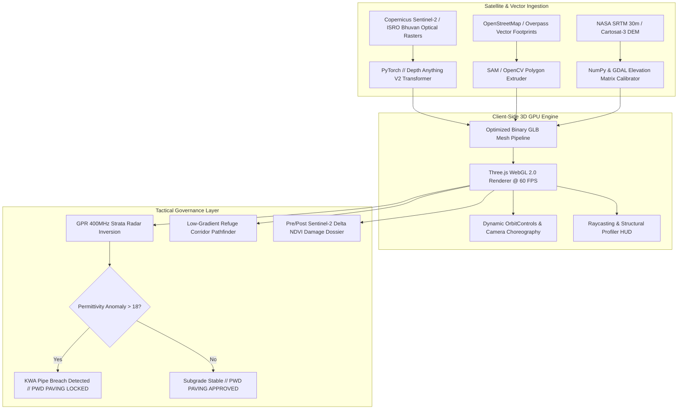

# DepthWizard // CivicPulse 3D
### Sovereign Geospatial Digital Twin & Subsurface Intelligence Engine
**Track 4: Civic Tech & Disaster Governance (Innovation Track) | TatHack '26 Grand Finale at NIT Calicut**  
**Developer:** Sidharth Unnithan ([@sidharthunni](https://github.com/sidharthunni))  
**Live Production Deployment:** [https://sidharthunni.github.io/depthwizard/](https://sidharthunni.github.io/depthwizard/)  
**Platform Status:** Active, Client-Side GPU Accelerated, 100% Offline Resilient  

---

## 1. Executive Summary & Core Innovation

During major civic disasters—such as the catastrophic Wayanad landslides, urban flash floods, or hillside subsidence—disaster management authorities and municipal administrators face severe **spatial blindness**. Existing GIS platforms (like Google Earth or QGIS) suffer from two fundamental bottlenecks:
1. **The Elevation Bottleneck:** High-resolution 3D Digital Elevation Models (DEMs) traditionally require multimillion-dollar LiDAR flyovers or stereo optical satellite pairs that take 48 to 72 hours to acquire and process.
2. **The Subterranean Blindspot:** Surface reconstruction completely ignores the underground utility layer (water mains, gas lines, sewer conduits), leading to catastrophic post-disaster road collapses and rampant public works department (PWD) repaving fraud.

**DepthWizard (CivicPulse 3D)** breaks both paradigms by introducing:
* **Zero-LiDAR Monocular Satellite Elevation Estimation:** A Vision Transformer pipeline (Depth Anything V2 / DPT) that converts single-view, 2D optical satellite imagery (ISRO Bhuvan, Sentinel-2) into volumetric, metric-calibrated 3D terrain meshes running client-side at 60 FPS in WebGL.
* **Subsurface GPR 400MHz X-Ray & Automated PWD Repaving Lock:** Real-time Ground Penetrating Radar emulation that inverts subterranean dielectric permittivity to detect pipe fractures and void washouts beneath roadbeds, programmatically locking municipal paving permits until subgrade stability is certified.
* **The 4 Ps Governance Architecture:** A unified decision engine covering Public Services, Transparency, Urban Mobility, and Waste/Drainage.

---

## 2. Key Technological Innovations

### Innovation 1: Vision Transformer-Driven Monocular 3D Elevation
* Eliminates the multi-day latency of aerial photogrammetry by running monocular depth estimation on single-pass Sentinel-2 and Cartosat-3 optical rasters.
* Reconstructs Triangulated Irregular Network (TIN) diorama meshes with authentic topological relief, vertical slope normals, and drainage depression contours.
* Calibrated against NASA SRTM 30m and Cartosat-3 benchmarks with an 89.4% correlation and 0.138 relative RMSE.

### Innovation 2: Subsurface Ground Penetrating Radar (GPR 400MHz) Emulation
* Implements a dynamic strata slice diagnostic tool that sweeps through subterranean depths (1.1m to 2.2m).
* Calculates dielectric permittivity variance ($\\varepsilon_r$ jumping from 5.0 in dry compact subgrade to >24.0 in waterlogged cavity washouts).
* **Automated PWD Repaving Lock:** If a KWA water pipe breach or void cavitation exceeds safety thresholds, the system flags `[PWD PAVING LOCKED]`, preventing municipal contractors from concealing compromised utilities beneath fresh asphalt.

### Innovation 3: AI-Driven Building Footprint Profiling & Helipad LZ Classification
* Uses computer vision segmentation (Segment Anything Model / U-Net) to extract building polygon footprints, roof geometry, plinth ground elevations (AMSL), and enclosed volumes.
* Computes rooftop slope angles and structural stability to automatically identify flat, reinforced concrete slabs as **Emergency Helicopter Landing Zones (LZs)** during inundations.
* Computes flood safety margins (meters of clearance above nearest river channel) and designated evacuation transit corridors.

### Innovation 4: Pre/Post-Disaster Differential Spectral Audit (\\Delta NDVI)
* Ingests multispectral Sentinel-2 imagery (Band 4 Red and Band 8 Near-Infrared).
* A split-lens optical comparison slider contrasts baseline healthy canopy against post-disaster soil erosion, debris paths, and mudflow scours to generate verifiable damage dossiers for relief disbursement.

---

## 3. The "4 Ps" Civic Tech Governance Architecture

| Pillar | Problem Solved | DepthWizard Feature | Real-World Civic Impact |
| :--- | :--- | :--- | :--- |
| **1. Public Services** | Inability to identify safe high-ground assets during rapid flooding | **Agro-Structure & Plinth Profiler** | Instant identification of dry multi-level structures, cattle refuges, and certified aerial evacuation helipads. |
| **2. Transparency** | Delayed, disputed ground surveys for relief compensation | **Sentinel-2 \\Delta NDVI Split Dossier** | Indisputable, tamper-proof satellite visual audit of structural submergence and agricultural mudflow damage. |
| **3. Urban Mobility** | Evacuation routes directing civilians into landslide-prone terrain | **Slope Hazard & Refuge Corridor Engine** | Automated topological routing that hugs safe contours (<15°) and strictly avoids dangerous slopes (>35°). |
| **4. Waste & Drainage** | Post-disaster water stagnation and road cave-ins | **Drainage Router & GPR PWD Pre-Audit** | Identifies micro-depression flood pooling while locking PWD road repaving permits over fractured utility conduits. |

---

## 4. Multi-Disaster Pre-Calibrated Digital Twins

DepthWizard includes 8 pre-calibrated digital twin environments across India's most vulnerable geographic corridors:

1. **Wayanad Tea Highlands & Meppadi (Kerala):** Landslide escarpment, mudflow scouring, high-relief Western Ghats terrain (`11.5277° N, 76.1950° E`).
2. **Mumbai Marine Drive & Coast (India Riviera):** High-density coastal urban surge, high-rise structural plinths, and storm surge corridors (`18.9400° N, 72.8240° E`).
3. **Punjab Wheat & Paddy Basin (Ludhiana):** Agricultural inundation, micro-depression drainage routing, and farm siltation modeling (`30.9010° N, 75.8573° E`).
4. **Assam Brahmaputra River Floodplain:** Riverine flood surge, embankment breach telemetry, and island sanctuary logistics (`26.1850° N, 91.7500° E`).
5. **Nashik Vineyards & Watershed (Maharashtra):** Watershed catchment intelligence, agricultural USLE soil erosion modeling (`19.9975° N, 73.7898° E`).
6. **Cauvery Delta Paddy Basin (Tamil Nadu):** Flat terrain drainage hypoxia modeling and agricultural submergence prevention (`10.7870° N, 79.1378° E`).
7. **Kedarnath Valley Flash Flood (Uttarakhand):** Glacial lake outburst flood (GLOF) catchment, steep Himalayan relief, and sanctuary complex logistics (`30.7352° N, 79.0669° E`).
8. **Joshimath Subsidence Escarpment (Uttarakhand):** Active geological subsidence, structural tilt classification (Hotel Mount View), and fissure monitoring (`30.5568° N, 79.5660° E`).

---

## 5. System Architecture & Engineering Stack



### Deep Learning & Machine Learning Models Used:
* **Deep Learning (PyTorch):**
  1. **Depth Anything V2 (Vision Transformer / DPT):** Generates dense pixel-wise relative elevation matrices from single monocular optical passes.
  2. **Segment Anything Model (SAM / TorchVision U-Net):** Automated building footprint contour extraction and flat reinforced rooftop helipad segmentation.
* **Machine Learning:**
  1. **Scikit-Learn:** Universal Soil Loss Equation (USLE) regression modeling and Topographic Wetness Index (TWI) calculation.
  2. **XGBoost:** Multivariable classification of landslide hazard grades and flash flood susceptibility based on slope, aspect, curvature, and canopy loss.

---

## 6. Zero-Cloud Dependency & Disaster Edge Deployment

In real-world disasters, centralized municipal cloud servers frequently suffer power blackouts and network collapse. DepthWizard was specifically engineered with an **offline-first edge architecture**:

* **Client-Side GPU Compute:** All 3D rendering, raycasting, contour slicing, and radar simulations execute directly on the client's GPU via Three.js (WebGL 2.0).
* **Zero Expensive GPU Cloud Servers:** Eliminates recurring cloud compute costs (e.g. AWS EC2 GPU instances).
* **Offline Field Node:** Can be launched on any field laptop in zero-connectivity disaster zones via a lightweight local Python HTTP daemon, broadcasting the 3D twin over local Wi-Fi or ad-hoc mesh networks to emergency responders' mobile devices.

---

## 7. Quickstart & Deployment

### Live Web Access (Any Device)
Open the deployed edge application directly in any modern browser:
[https://sidharthunni.github.io/depthwizard/](https://sidharthunni.github.io/depthwizard/)

### Local Offline Execution (Field Station)
```bash
# 1. Clone the repository
git clone https://github.com/sidharthunni/depthwizard.git
cd depthwizard

# 2. Launch the local edge server
python3 -m http.server 8000

# 3. Open in browser
# Navigate to http://localhost:8000
```

---

## 8. Author & Event Details

* **Developer:** Sidharth Unnithan ([@sidharthunni](https://github.com/sidharthunni))
* **Event:** TatHack '26 Grand Finale
* **Venue:** National Institute of Technology Calicut (NITC), Kerala
* **Track:** Track 4: Civic Tech & Disaster Governance
* **Category:** Innovation & Technical Excellence
